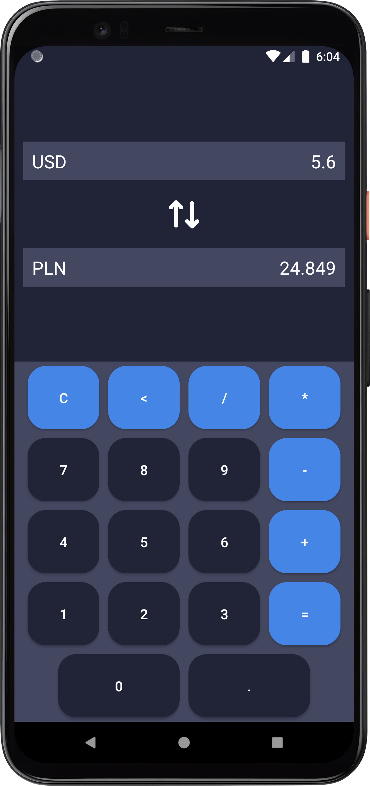
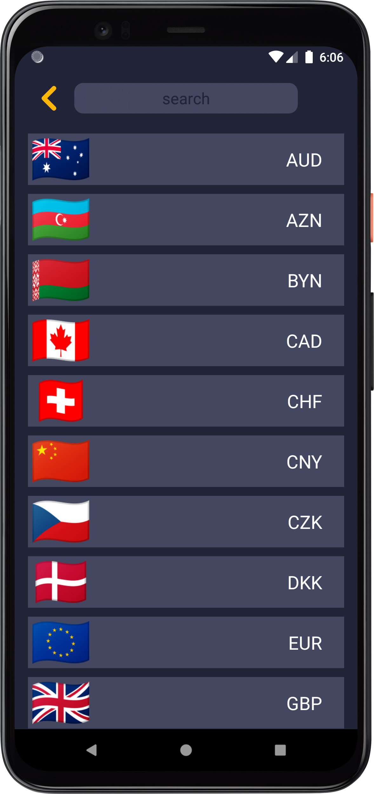

# Currency Converter

## Application screenshots

  
  

## Download

    git clone https://github.com/Ch-Tima/CurrencyConverter.git

I also have a public version on "Google Play Store", if you want to support me, you can install [_here_](https://play.google.com/store/apps/details?id=com.chtima.currencyconverter)!

